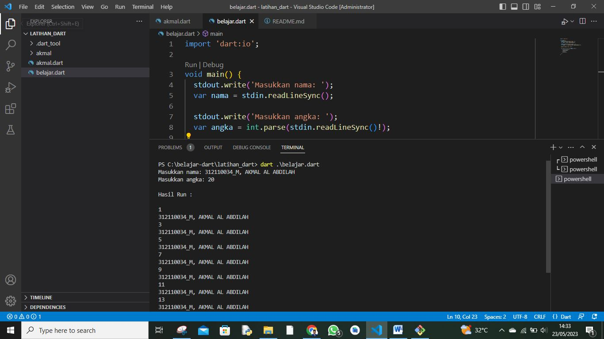

# Pemograman_Mobile2-Latihan_Dart
## Latihan Menggunakan Bahasa Dart


<p align="center">
 
</p>
<p align="center">
<a href="https://github.com/akmalabdilah"></a>
<p align="center">

<p align="center">
<a href="https://github.com/akmalabdilah/Pemograman_Mobile2-Latihan_Dart">Requirements</a> •
<a href="https://github.com/akmalabdilah/Pemograman_Mobile2-Latihan_Dart">Informasi</a> •
<a href="https://github.com/akmalabdilah/Pemograman_Mobile2-Latihan_Dart">Tutorial</a>
</p>
</div>

# Requirements
- [Dart](https://git-scm.com/download)

# Informasi Dart
Apa itu Dart?
<p>
Dart adalah bahasa pemrograman yang dikembangkan oleh Google. Dart didesain untuk membangun aplikasi lintas platform, termasuk aplikasi mobile untuk Android dan iOS, aplikasi web, dan juga aplikasi desktop. Dart memiliki sintaks yang mirip dengan bahasa pemrograman C dan JavaScript, sehingga relatif mudah dipelajari bagi para pengembang yang sudah memiliki pengalaman dengan bahasa-bahasa tersebut. Salah satu keunggulan Dart adalah fitur Just-in-Time (JIT) dan Ahead-of-Time (AOT) compilation yang memungkinkan aplikasi yang ditulis dengan Dart berjalan dengan performa tinggi. Dart juga dilengkapi dengan kerangka kerja Flutter yang populer untuk pengembangan aplikasi mobile dan UI yang kaya.
</p>

# Tutorial
- Pada saat pertama kali menggunakan Dart, perlu dilakukan penginstalan extension
di visual Studio Code. Jalankan perintah berikut:

```bash
> Dart
```


- Setelah itu jalankan perintah Ctrl+Shift+P dan tulis Dart: New Project. untuk membuat repository 

- Untuk membuat file pilih yang bagian ke dua dan berilah nama sesuka kalian dan jika sudah di pindahkan ke halaman folder hapus isi yang ada di polder dan buat file baru di dalam polder tersebut.

- Dan ini adalah koding dart serta hasil runnya

- 0. Membuat pemograman perulangan dart 1 sampai 10 bilangan genab di ganti nama.



```dart
import 'dart:io';

void main() {
  stdout.write('Masukkan nama: ');
  var nama = stdin.readLineSync();

  stdout.write('Masukkan angka: ');
  var angka = int.parse(stdin.readLineSync()!);

  print('\nHasil Run :\n');

  for (int i = 1; i <= angka; i++) {
    if (i % 2 == 0) {
      print(nama);
    } else {
      print(i);
    }
  }
}
```

- 1. Membuat pemograman perulangan dart 1 sampai 10 bilangan ganjil di ganti nama.


```dart
import 'dart:io';

void main() {
  stdout.write('Masukkan nama: ');
  var nama = stdin.readLineSync();

  stdout.write('Masukkan angka: ');
  var angka = int.parse(stdin.readLineSync()!);

  print('\nHasil Run :\n');

  for (int i = 1; i <= angka; i++) {
    if (i % 2 == 0) {
      print(i);
    } else {
      print(nama);
    }
  }
}

```


- Penjalasan koding di di bawah perulangan For
perulangan for merupakan perulangan yang termasuk dalam couted loop, karena sudah
jelas berapa kali ia akan mengulang.
NamaFile:for1.dart

- 2. Perulangan For


```dart
main() {
int n = 10;
print("3121100_M. AKMAL AL ABDILAH: $n");
for (int i = 1; i <= n; i++) {
print("Perulangan ke-$i");
}
}
```

- Penjelasan kode dart di bawah Perulangan foreach biasanya digunakan untuk mencetak item di dalam array atau list.
Perulangan ini termasuk dalam perulangan counted loop, karena jumlah perulangannya akan
ditentukan oleh panjang dari array.
Perulangan foreach pada Dart sebenarnya adalah sebuah
perulangan for yang menggunakan kata kunci in.
NamaFile:forin.dart.

- 3. Perulangan Foreach.


```dart
import 'dart:io';

main() {
  var cemilan = ["Comro", "Gehu", "Cireng", "Cilok", "Javascript"];
  print("Daftar Cemilan ");
  print("----------------");
  for (var makanan in cemilan) {
    print(makanan);
  }
  print("----------------");
  print("Total Cemilan : ${cemilan.length}");
}

```

- 4. Perulangan while


```dart
import 'dart:io';
main() {
int i = 1;
while (i <= 10) {
print("Rovyansyah ke : $i");
i++;
}
}

```

- 5. Perulangan do..while
- Perulangan do..while hampir sama dengan while ia akan terus melakukan perulangan
selama kondisi masih memenuhi.
NamaFile:dowhile.dart


```dart
import 'dart:io';
main() {
int i = 10;
do{
print("Perulangan ke : $i");
i--;
}
while(i>=1);
}

```

- Selesai


<div>
<h2 align="center">Thanks For Reading!!!</h2>
<div align="center">
